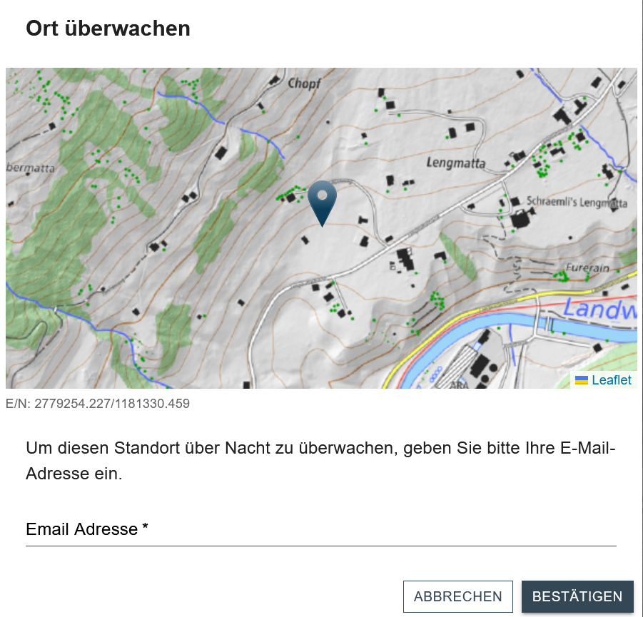

# StarryEyes

Projektwebseite von *StarryEyes*. Die App enthält eine Server und eine Client Umgebung.
- Server: FastAPI, Geoserver
- Client: React + Leaflet

GitHub Repository: [FredrikLennstroem/Starry-Eyes](https://github.com/FredrikLennstroem/Starry-Eyes)

## Inhaltsverzeichnis
- [Die App](#beschrieb)   
- [Anwendung](#funktionen)
    - [Video](#video)
    - [Willkommenstext](#willkommenstext)
    - [Hintergrundkarte](#karte)
    - [Layer](#layer)
    - [Mondphasen](#mond)
    - [Popup](#popup)
- [Architektur Backend](#backend)
    - [Backend](#backend)
- [Architektur Frontend](#frontend)
    - [Frontend](#frontend)
- [Incoming Features](#features)
- [Contribution](#contribution)

## Die App

Die App ermöglicht die Planung von Sternen- und Sonnenaufgangs-/untergangsfotos. Nutzer können mit integrierten Lichtverschmutzungs- und Schattenkarten den idealen Fotostandort wählen. Die App bietet Zugriff auf aktuelle Wetterdaten über eine API (z.B. Wolkenabdeckung). Mit der Überwachungsfunktion können Nutzer per Email über das optimale Zeitfenster für das Foto am ausgewählten Standort informiert werden. Zur weiteren Unterstützung der Planung sind die aktuellen Mondphasen graphisch dargestellt.

## Installation

Installation der APP erfolgt mit der Anleitung im github repository:
[FredrikLennstroem/Starry-Eyes](https://github.com/FredrikLennstroem/Starry-Eyes)

## Anwendung

### Video

Video incoming

### Willkommenstext

Beim ersten Öffnen der App erhält man eine kurze Erklärung eingeblendet (siehe Abbildung). Durch bestätigen der Checkbox wird diese dem Nutzenden beim erneuten zugreifen auf die App nicht mehr angezeigt. Zu Testzwecken kann dieser Entscheid durch klicken auf das StarryEyes Logo rückgängig gemacht werden.

### Hintergrundkarte

Im Hintergrund sind zwei unterschiedliche Karten der Swisstopo, je nach Zoomstufe. Bis Zoomlevel 15 ist die farbige Pixelkarte sichtbar. Diese bietet dem Nutzenden gute Anhaltspunkte sich zu orientieren. Ab Zoomlevel 16 wird dannn die swissTLM-Map (farbig) dargestellt. Diese ist hauptsächlich für den Massstabsbereich 1:10'000 - 1:5'000 geeignet und zeigt eine genauere Darstellung des Geländes. So ist es möglich, den gewünschten Standort exakter abzusetzen.

### Layer

Das Menuicon Oben Links bietet die Möglichkeit, folgende zusätzliche Layer einzublenden:
- Schattenkarte: Sie zeigt den Schattenwurf des jeweiligen Tages im Viertelstundentakt. Die Zeit kann über einen Slider bestimmt werden.
- Lichtverschmutzungskarte: Sie zeigt die Lichtverschmutzung in vier verschiedenen Klassen (keine, wenig, hohe oder starke Lichtverschmutzung) über die ganze Schweiz.
- Symbolerklärungen: Hier wird eine neue Seite eingeblendet, die alle verwendeten Symbole kurz erklärt.

### Mondphasen

Am rechten Rand findet sich ein Mondsymbol. Dieses öffnet die Information zu den Mondphasen der kommenden drei Nächte. Die Erklärung zu den Mondphasensymbolen und der Link zur verwendeten Klassierung, findet der Nutzende in der [Symbolerklärung](#layer).

### Popup
<a id=popup>

Wird auf die Positionsnadel geklickt, zeigt ein Popup Informationen zum gewählten Standort an:
- Sonnenzeiten
    - Sonnenuntergang / -aufgang Gelände
    - Sonnenuntergang / -aufgang Horizont
- Wolkenabdeckung in Prozent
    - Tag
    - Nacht

Wenn ein Standort von Interesse ist, kann er über Nacht überwacht werden. Durch Klicken auf "ORT ÜBERWACHEN" öffnet sich ein Eingabefenster, in dem eine E-Mail-Adresse für Benachrichtigungen eingegeben werden kann. Nach Eingabe der E-Mail-Adresse wird eine Bestätigung an diese Adresse gesendet. Diese Bestätigung enthält aktuelle Wetterinformationen und ein Hemisphärenbild des Standorts. Diese Funktion ist nur für eine Nacht aktiv.

## Architektur Backend

### API
Um aktuelle Wetterinformationen anzeigen zu können wird eine Wetter-API benötigt. Dazu wird die API von Open-Meteo verwendet:

[https://open-meteo.com/](https://open-meteo.com/)

Es werden die Wolkenabdeckungen auf tiefer, mittlerer und hoher Höhe bezogen, sowie das aktuelle Wetter (z.B. "Regen").

### Berechnung Sonnenstand
Der Sonnenstand wird auf zwei verschiedene Arten berechnet:
- Theoretisch: Sonnenuntergang/-aufgang hinter dem Horizont. Dazu wird die 'Pyephem'-Bibliothek von Brandon Rhodes verwendet: [Pyephem](https://github.com/brandon-rhodes/pyephem)
- Im Gelände: Sonnenuntergang/-aufgang hinter dem Gelände. Dies wird mit der 'tppss'-Bibliothek von gvellut berechnet: [tppss](https://github.com/gvellut/tppss)

Diese beiden Methoden sind im Backend in einer Funktion verbaut die im Frontend als Rest-API aufgerufen werden kann.

### Email Benachrichtigung
"Lorem ipsum dolor sit amet, consectetur adipiscing elit, sed do eiusmod tempor incididunt ut labore et dolore magna aliqua. Ut enim ad minim veniam, quis nostrud exercitation ullamco laboris nisi ut aliquip ex ea commodo consequat. Duis aute irure dolor in reprehenderit in voluptate velit esse cillum dolore eu fugiat nulla pariatur. Excepteur sint occaecat cupidatat non proident, sunt in culpa qui officia deserunt mollit anim id est laborum."

### Geoserver

Beschrieb Geoserver

## Architektur Frontend

"Lorem ipsum dolor sit amet, consectetur adipiscing elit, sed do eiusmod tempor incididunt ut labore et dolore magna aliqua. Ut enim ad minim veniam, quis nostrud exercitation ullamco laboris nisi ut aliquip ex ea commodo consequat. Duis aute irure dolor in reprehenderit in voluptate velit esse cillum dolore eu fugiat nulla pariatur. Excepteur sint occaecat cupidatat non proident, sunt in culpa qui officia deserunt mollit anim id est laborum."

- Ordnerstruktur und Aufbau
- Design
 - Rückmeldung für erfolgreiches Abonieren, was wird abgefangen?
 - Darstellung und Klassierung der Lichtverschmutzung
 - Farbkonzept
 - Symbolkonzept
 - MuiKonzept
 - Hovertexte und Alternativtexte von Icons und Buttons

## Upcoming Features

- [x] Feature 1
- [ ] Feature 2
- [ ] Feature 3
- [ ] Berücksichtigung der Lichtverschmutzung zur Einschätzung der Sternensichtbarkeit
- [ ] Suchfunktion gemäss MockUp
- [ ] Luftbilder als zusätzlichen Layer
- [ ] Live Hemisphärenbild mit Sternenbilder?
- [ ] Live Positionserfassung
- [ ] Mobileversion

### Panoramabild

## Contribution

- Alex Burà, GitHub: [alexbura](https://github.com/alexbura)
- Fredrik Lennström, GitHub: [FredrikLennstroem](https://github.com/FredrikLennstroem)
- Silas Haab, GitHub: [SilasHaab](https://github.com/SilasHaab)

[Zurück nach oben](#start)