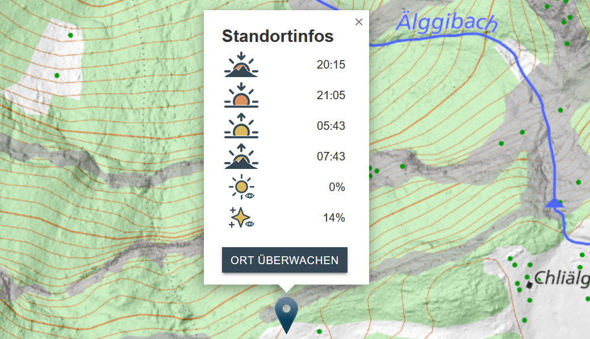

# StarryEyes

Projektwebseite von *StarryEyes*. Die App enthält eine Server und eine Client Umgebung.
- Server: FastAPI, Geoserver
- Client: React + Leaflet

GitHub Repository: [FredrikLennstroem/Starry-Eyes](https://github.com/FredrikLennstroem/Starry-Eyes)

## Inhaltsverzeichnis
- [Die App](#beschrieb)   
- [Anwendung](#funktionen)
    - [Video](#video)
    - [Willkommenstext](#willkommenstext)
    - [Hintergrundkarte](#karte)
    - [Layer](#layer)
    - [Mondphasen](#mond)
    - [Popup](#popup)
    - [Standort überwachen](#standortueberwachen)
- [Architektur Backend](#backend)
    - [API](#api)
    - [Berechnung Sonnenstand](#sonnenstand)
    - [Email Benachrichtigung](#email)
    - [Schatten Berechnung](#schatten)
    - [Geoserver](#geoserver)
- [Architektur Frontend](#frontend)
    - [Mockup](#mockup)
    - [Berechnung Mondphasen](#berechnungmond)
    - [Lichtverschmutzungskarte](#lichtverschmutzungskarte)
    - [Farb- und Symbolkonzept](#farbsymbolkonzept)
    - [Feedback Features](#feedback-features)
- [Incoming Features](#features)
- [Contribution](#contribution)

## Die App

Die App ermöglicht die Planung von Sternen- und Sonnenaufgangs-/untergangsfotos. Nutzer können mit integrierten Lichtverschmutzungs- und Schattenkarten den idealen Fotostandort wählen. Die App bietet Zugriff auf aktuelle Wetterdaten über eine API (z.B. Wolkenabdeckung). Mit der Überwachungsfunktion können Nutzer per Email über das optimale Zeitfenster für das Foto am ausgewählten Standort informiert werden. Zur weiteren Unterstützung der Planung sind die aktuellen Mondphasen graphisch dargestellt.

## Installation

Installation der APP erfolgt mit der Anleitung im github repository:
[FredrikLennstroem/Starry-Eyes](https://github.com/FredrikLennstroem/Starry-Eyes)

## Anwendung

### Video

Das Video gibt Ihnen eine kurzen Einblick in die Funktionalität dieser App:

<iframe src="images/StarryEyes_Video.mp4" style="width: 100%; height: auto; border: none;" allowfullscreen></iframe>

### Willkommenstext

Beim ersten Öffnen der App erhält man eine kurze Erklärung eingeblendet. Durch bestätigen der Checkbox wird diese dem Nutzenden beim erneuten zugreifen auf die App nicht mehr angezeigt. Zu Testzwecken kann dieser Entscheid durch klicken auf das StarryEyes Logo rückgängig gemacht werden.

### Hintergrundkarte

Im Hintergrund sind zwei unterschiedliche Karten der Swisstopo, je nach Zoomstufe. Bis Zoomlevel 15 ist die farbige Pixelkarte sichtbar. Diese bietet dem Nutzenden gute Anhaltspunkte sich zu orientieren. Ab Zoomlevel 16 wird dannn die swissTLM-Map (farbig) dargestellt. Diese ist hauptsächlich für den Massstabsbereich 1:10'000 - 1:5'000 geeignet und zeigt eine genauere Darstellung des Geländes. So ist es möglich, den gewünschten Standort exakter abzusetzen.

### Layer

Das Menuicon Oben Links bietet die Möglichkeit, folgende zusätzliche Layer einzublenden:
- Schattenkarte: Sie zeigt den Schattenwurf des jeweiligen Tages im Viertelstundentakt. Die Zeit kann über einen Slider bestimmt werden.
- Lichtverschmutzungskarte: Sie zeigt die Lichtverschmutzung in vier verschiedenen Klassen (keine, wenig, hohe oder starke Lichtverschmutzung) über die ganze Schweiz.
- Symbolerklärungen: Hier wird eine neue Seite eingeblendet, die alle verwendeten Symbole kurz erklärt.

### Mondphasen

Am rechten Rand findet sich ein Mondsymbol. Dieses öffnet die Information zu den Mondphasen der kommenden drei Nächte. Die Erklärung zu den Mondphasensymbolen und der Link zur verwendeten Klassierung, findet der Nutzende in der [Symbolerklärung](#layer).

### Popup

Wird auf die Positionsnadel geklickt, zeigt ein Popup Informationen zum gewählten Standort an:
- Sonnenzeiten
    - Sonnenuntergang / -aufgang Gelände
    - Sonnenuntergang / -aufgang Horizont
- Wolkenabdeckung in Prozent
    - Tag
    - Nacht

### Standort überwachen

Wenn ein Standort von Interesse ist, kann er über Nacht überwacht werden. Durch Klicken auf "ORT ÜBERWACHEN" öffnet sich ein Eingabefenster, in dem eine E-Mail-Adresse für Benachrichtigungen eingegeben werden kann. Nach Eingabe der E-Mail-Adresse wird eine Bestätigung an diese Adresse gesendet. Diese Bestätigung enthält aktuelle Wetterinformationen und ein Hemisphärenbild des Standorts. Diese Funktion ist nur für eine Nacht aktiv.

## Architektur Backend

### API

Um aktuelle Wetterinformationen anzeigen zu können wird eine Wetter-API benötigt. Dazu wird die API von Open-Meteo verwendet:
[https://open-meteo.com/](https://open-meteo.com/)

Es werden die Wolkenabdeckungen auf tiefer, mittlerer und hoher Höhe bezogen, sowie das aktuelle Wetter (z.B. "Regen").

### Berechnung Sonnenstand

Der Sonnenstand wird auf zwei verschiedene Arten berechnet:
- Theoretisch: Sonnenuntergang/-aufgang hinter dem Horizont. Dazu wird die 'Pyephem'-Bibliothek von Brandon Rhodes verwendet: [Pyephem](https://github.com/brandon-rhodes/pyephem)
- Im Gelände: Sonnenuntergang/-aufgang hinter dem Gelände. Dies wird mit der 'tppss'-Bibliothek von gvellut berechnet: [tppss](https://github.com/gvellut/tppss)

Diese beiden Methoden sind im Backend in einer Funktion verbaut die im Frontend als Rest-API aufgerufen werden kann.

### Email Benachrichtigung

"Lorem ipsum dolor sit amet, consectetur adipiscing elit, sed do eiusmod tempor incididunt ut labore et dolore magna aliqua. Ut enim ad minim veniam, quis nostrud exercitation ullamco laboris nisi ut aliquip ex ea commodo consequat. Duis aute irure dolor in reprehenderit in voluptate velit esse cillum dolore eu fugiat nulla pariatur. Excepteur sint occaecat cupidatat non proident, sunt in culpa qui officia deserunt mollit anim id est laborum."

### Schatten Berechnung

Die Idee ist, jeden Tag (in der Nacht) alle notwendigen Tiff-Dateien zu berechnen und zu erstellen, um den Verlauf der Schatten darstellen zu können. Es wird zuerst die sogenannte "Horizon Angle" berechnet und dann wird überprüft, ob die steilste Neigung grösser oder kleiner als die Sonnenhöhe ist.
Die Berechnung der Sonnenposition erfolgt mit Hilfe des Moduls "suncalc" (https://pypi.org/project/suncalc/) und die der "Horizon Angle" dank einer Funktion ("horizonangle") von Whitebox Geospatial (https://www.whiteboxgeo.com/).
Mit dem Schedule-Modul kann der Startzeitpunkt der Funktion programmiert werden.

### Geoserver

Über einen lokal aufgesetzten Geoserver werden die zwei einblendbaren Layer publiziert und im Frontend dann als WMS dargestellt. Die Lichtverschmutzung ist eine einzelne GeoTiff Datei, während der Schattenlayer aus 96 GeoTiff Dateien besteht. Diese werden aus einem Orderverzeichnis bezogen und jeweils in der Nacht für den folgenden Tag neu gerechnet. Die Darstellung der Layer wird via *.sld-Datei auf dem Geoserver importiert und als zusätzlicher Parameter vom Frontend bezogen.

## Architektur Frontend

### Mock-Up

Das Mock-Up dient der ersten Überisicht über die App. Es zeigt den geplanten Aufbau und das ungefähre Aussehen und ist ein grosses Hilfsmittel beim Erstellen des Frontends.

### Berechnung Mondphasen

Die Mondphasen werden mit dem npm Modul [lunarphase-js](https://www.npmjs.com/package/lunarphase-js) berechnet. Die Einteilung in die acht Mondphasen wurde ebenfalls daraus übernommen.

### Lichtverschmutzungskarte

Die Daten der Lichtverschmutzung wurden als Tiff von [Lightpollutionmap.info](https://www.lightpollutionmap.info/) bezogen. Diese werden jährlich aktualisiert. Die Werte reichen von 0 bis 75 magnitude/arcsec2 welche die Flächenhelligkeit beschreibt. Diese Werte können in Klassen aufgeteilt werden, welche die Sichtbarkeit der Sterne beschreiben ([Bortle Dark Sky Scale](https://www.handprint.com/ASTRO/bortle.html)). Aufgrund dieser Einschätzung haben wir uns entschieden vier für den Nutzenden unserere App relevante Klassen zu erstellen:
- <0.5:&ensp;&nbsp;keine Lichtverschmutzung
- 0.5-1:&ensp;wenig Lichtverschmutzung
- 1-9:&emsp;&nbsp;hohe Lichtverschmutzung
- \>9:&emsp;&ensp;starke Lichtverschmutzung

### Farb- und Symbolkonzept

Die Farbe #334854 wurde in der ganzen App als Hauptakzentfarbe verwendet und tritt immer wieder auf. Der dunkle Grau-Ton mit Blaustich soll die ganze Seite farblich umrahmen.
Als Sekundärfarbe wurde dann noch ein etwas hellerer Grau-Blau-Ton #667784 gewählt. Dieser wurde verwendet um das Hovern auf Buttons und Icons darzustellen und so dem Nutzenden ein Feedback zu geben.

Buttons, Checkboxen, Icons, etc. stammen alle aus der [MUI-Bibliothek](https://mui.com/) und wurden entsprechend dem Farbkonzept angepasst. So konnte einfach eine einheitliche Seite aufgebaut werden. Die Elemente wurden mit Ecken und ohne Abrundungen versehen. Auch so entstand ein gleichmässiges Erscheinungsbild.

Alle verwendeten Symbole wurden selbst designt, sodass ein konsistentes Erscheinungsbild entsteht. Es wurde darauf geachtet, dass sie ins Farbkonzept passen und dass sie möglichst intuitiv zu verstehen sind.

Icons, Symbole und Bilder wurden mit Hovertexten versehen, die dem Nutzenden eine schnelle und kurze Erklärung dazu abgeben. Wo möglich wurde zudem ein Alternativtext vergeben. Dieser wird angezeigt, wenn ein Element nicht geladen werden kann oder er wird erkannt, wenn die Seite mit einem Leseprogramm vorgelesen wird.

### Feedback Features

Beim Abfragen der Standortinformation im PopUp des Markes kann es einige Sekunden dauern, bis die API die aktuellen Daten abgerufen hat. Diese Zeit wurde mit Ladekreisen überbrückt.  
Es ist wichtig dem Nutzenden Rückmeldungen auf seine Interaktionen zu geben. Also wurde das Abwarten der Übermittlung der Emailadresse mit einem Ladekreis auf dem Button dargestellt.Die erfolgreiche Übermittlung wurde ebenfalls abgefangen um ein kurzes Feedback auszulösen, welches nach kurzer Zeit wieder verschwindet.

## Upcoming Features

- [x] Berechnung der Wolkenabdeckung in Prozent
- [ ] Standortinformationen über Nacht überwachen
- [ ] Schnellers Rendering der Schattendaten
- [ ] Berücksichtigung der Lichtverschmutzung zur Einschätzung der Sternensichtbarkeit
- [ ] Live Hemisphärenbild
- [ ] Standort Suchfunktion
- [ ] Luftbilder als zusätzlichen Layer
- [ ] Live Positionserfassung
- [ ] Mobileversion

### Hemisphärenbild

## Contribution

- Alex Burà, GitHub: [alexbura](https://github.com/alexbura)
- Fredrik Lennström, GitHub: [FredrikLennstroem](https://github.com/FredrikLennstroem)
- Silas Haab, GitHub: [SilasHaab](https://github.com/SilasHaab)

[Zurück nach oben](#start)