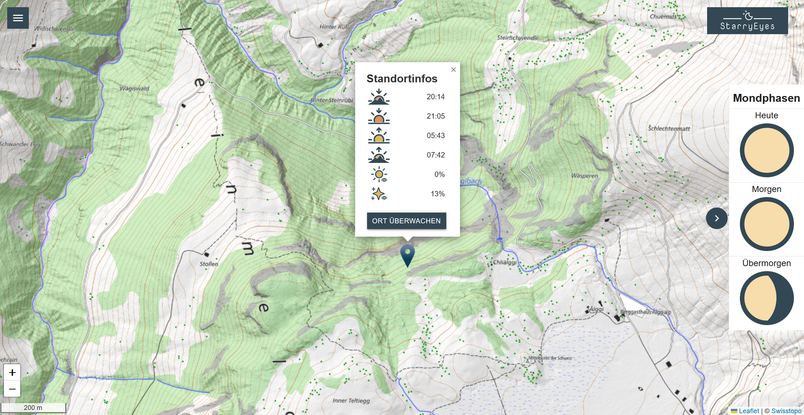

# StarryEyes

Projektwebseite von *StarryEyes*. Das App enthält eine Server und eine Client Umgebung.
- Server: FastAPI, Geoserver
- Client: React + Leaflet

GitHub Repository: [FredrikLennstroem/Starry-Eyes](https://github.com/FredrikLennstroem/Starry-Eyes)

## Inhaltsverzeichnis
- [Die App](#beschrieb)
- [Architektur](#architektur)
    - [Backend](#backend)
    - [Frontend](#frontend)   
- [Anwendung](#funktionen)
    - [Hintergrundkarte](#karte)
    - [Layer](#layer)
    - [Mondphasen](#mond)
    - [Popup](#popup)
- [Video](#video)
- [Incoming Features](#features)
- [Contribution](#contribution)

## Die App

Die App ermöglicht die Planung von Sternen- und Sonnenaufgangs-/untergangsfotos. Nutzer können mit integrierten Lichtverschmutzungs- und Schattenkarten den idealen Fotostandort wählen. Die App bietet Zugriff auf aktuelle Wetterdaten über eine API (z.B. Wolkenabdeckung). Mit der Überwachungsfunktion können Nutzer per Email über das optimale Zeitfenster für das Foto am ausgewählten Standort informiert werden. Zur weiteren Unterstützung der Planung sind die aktuellen Mondphasen graphisch dargestellt.

## Architektur

### Backend

#### API
Um aktuelle Wetterinformationen anzeigen zu können wird eine Wetter-API benötigt. Dazu wird die API von Open-Meteo verwendet:

[https://open-meteo.com/](https://open-meteo.com/)

Es werden die Wolkenabdeckungen auf tiefer, mittlerer und hoher Höhe bezogen, sowie das aktuelle Wetter (z.B. "Regen").

#### Berechnung Sonnenstand
"Lorem ipsum dolor sit amet, consectetur adipiscing elit, sed do eiusmod tempor incididunt ut labore et dolore magna aliqua. Ut enim ad minim veniam, quis nostrud exercitation ullamco laboris nisi ut aliquip ex ea commodo consequat. Duis aute irure dolor in reprehenderit in voluptate velit esse cillum dolore eu fugiat nulla pariatur. Excepteur sint occaecat cupidatat non proident, sunt in culpa qui officia deserunt mollit anim id est laborum."

#### Email Benachrichtigung
"Lorem ipsum dolor sit amet, consectetur adipiscing elit, sed do eiusmod tempor incididunt ut labore et dolore magna aliqua. Ut enim ad minim veniam, quis nostrud exercitation ullamco laboris nisi ut aliquip ex ea commodo consequat. Duis aute irure dolor in reprehenderit in voluptate velit esse cillum dolore eu fugiat nulla pariatur. Excepteur sint occaecat cupidatat non proident, sunt in culpa qui officia deserunt mollit anim id est laborum."

### Frontend

"Lorem ipsum dolor sit amet, consectetur adipiscing elit, sed do eiusmod tempor incididunt ut labore et dolore magna aliqua. Ut enim ad minim veniam, quis nostrud exercitation ullamco laboris nisi ut aliquip ex ea commodo consequat. Duis aute irure dolor in reprehenderit in voluptate velit esse cillum dolore eu fugiat nulla pariatur. Excepteur sint occaecat cupidatat non proident, sunt in culpa qui officia deserunt mollit anim id est laborum."

## Anwendung

### Hintergrundkarte

"Lorem ipsum dolor sit amet, consectetur adipiscing elit, sed do eiusmod tempor incididunt ut labore et dolore magna aliqua. Ut enim ad minim veniam, quis nostrud exercitation ullamco laboris nisi ut aliquip ex ea commodo consequat. Duis aute irure dolor in reprehenderit in voluptate velit esse cillum dolore eu fugiat nulla pariatur. Excepteur sint occaecat cupidatat non proident, sunt in culpa qui officia deserunt mollit anim id est laborum."

- Hintergrundkarte Im Hintergrund ist die Winterlandeskarte der Swisstopo (Bundesamt für Landestopografie swisstopo, 2024a.)

### Layer auswählen

- Lichtverschmutzungskarte
- Schattenkarte

### Mondphasen

- 3 Mondphasen

### Popup
<a id=popup>
- Beschrieb Popup
- Button

#### Detailkarte
Detailkarte

#### Sonnenstand
"Lorem ipsum dolor sit amet, consectetur adipiscing elit, sed do eiusmod tempor incididunt ut labore et dolore magna aliqua. Ut enim ad minim veniam, quis nostrud exercitation ullamco laboris nisi ut aliquip ex ea commodo consequat. Duis aute irure dolor in reprehenderit in voluptate velit esse cillum dolore eu fugiat nulla pariatur. Excepteur sint occaecat cupidatat non proident, sunt in culpa qui officia deserunt mollit anim id est laborum."

#### Wolkenabdeckung
"Lorem ipsum dolor sit amet, consectetur adipiscing elit, sed do eiusmod tempor incididunt ut labore et dolore magna aliqua. Ut enim ad minim veniam, quis nostrud exercitation ullamco laboris nisi ut aliquip ex ea commodo consequat. Duis aute irure dolor in reprehenderit in voluptate velit esse cillum dolore eu fugiat nulla pariatur. Excepteur sint occaecat cupidatat non proident, sunt in culpa qui officia deserunt mollit anim id est laborum."

#### Standort beobachten
Bei der Navigation wird ein Ziel aus einer Liste ausgewählt. Der Weg zum Ziel wird danach hervorgehoben. Unterhalb der Karte ist eine chronologische Auflistung der Pisten und Anla- gen welche auf der Route genutzt wird. Die Ziele in der Liste haben jeweils zusätzlich zum Namen ein Piktogramm, welches einfach erkennen lässt, ob es sich um eine Anlage, Parkplatz oder ein Restaurant handelt.

## Video

Video

## Upcoming Features

### Panoramabild

## Contribution

- Alex Burà, GitHub: [alexbura](https://github.com/alexbura)
- Fredrik Lennström, GitHub: [FredrikLennstroem](https://github.com/FredrikLennstroem)
- Silas Haab, GitHub: [SilasHaab](https://github.com/SilasHaab)

[Zurück nach oben](#start)