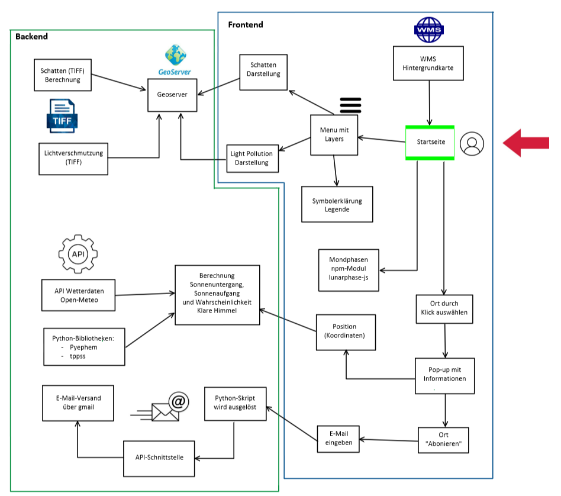
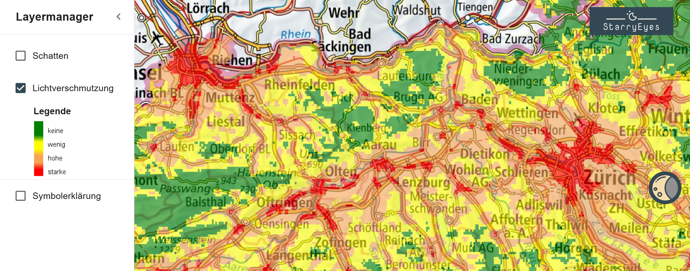
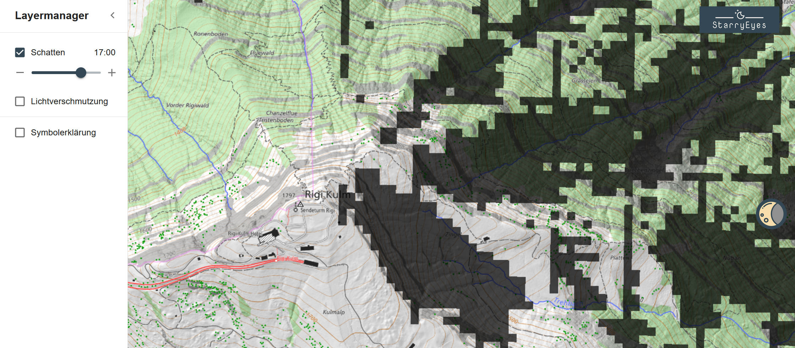

# StarryEyes

Projektwebseite von *StarryEyes*. Die App enthält eine Server- und eine Clientumgebung.
- Server: FastAPI, Geoserver
- Client: React + Leaflet

GitHub Repository: [FredrikLennstroem/Starry-Eyes](https://github.com/FredrikLennstroem/Starry-Eyes)

## Inhaltsverzeichnis
- [Die App](#beschrieb)   
- [Anwendung](#funktionen)
    - [Video](#video)
    - [Willkommenstext](#willkommenstext)
    - [Architekturdiagramm](#architekturdiagramm)
    - [Hintergrundkarte](#karte)
    - [Layer](#layer)
    - [Mondphasen](#mond)
    - [Popup](#popup)
    - [Standort überwachen](#standortueberwachen)
- [Architektur Backend](#backend)
    - [API](#api)
    - [Berechnung Sonnenstand](#sonnenstand)
    - [E-Mail Benachrichtigung](#email)
    - [Schatten Berechnung](#schattenber)
    - [Geoserver](#geoserver)
- [Architektur Frontend](#frontend)
    - [Mockup](#mockup)
    - [Berechnung Mondphasen](#berechnungmond)
    - [Lichtverschmutzungskarte](#lichtverschmutzungskarte)
    - [Schatten Visualisierung](#schattenvis)
    - [Farb- und Symbolkonzept](#farbsymbolkonzept)
    - [Feedback Features](#feedback-features)
- [Upcoming Features](#features)
- [Quellen](#quellen)
- [Contribution](#contribution)

## Die App

Die App ermöglicht die Planung von Sternen- und Sonnenaufgangs-/untergangsfotos. Nutzer können mit integrierten Lichtverschmutzungs- und Schattenkarten den idealen Fotostandort wählen. Die App bietet Zugriff auf aktuelle Wetterdaten über eine API (z.B. Wolkenabdeckung). Mit der Überwachungsfunktion können Nutzer per E-Mail über das optimale Zeitfenster für das Foto am ausgewählten Standort informiert werden. Zur weiteren Unterstützung der Planung sind die aktuellen Mondphasen graphisch dargestellt.

## Installation

Installation der APP erfolgt mit der Anleitung im github repository:
[FredrikLennstroem/Starry-Eyes](https://github.com/FredrikLennstroem/Starry-Eyes)

## Anwendung

### Video

Das Video gibt Ihnen einen kurzen Einblick in die Funktionalität dieser App:

<video width="100%" height="auto" controls>
  <source src="images/StarryEyes_Video.mp4" type="video/mp4">
</video>

### Willkommenstext

Beim ersten Öffnen der App erhält man eine kurze Erklärung eingeblendet. Durch Bestätigen der Checkbox wird diese dem Nutzenden beim erneuten zugreifen auf die App nicht mehr angezeigt. Zu Testzwecken kann dieser Entscheid durch Klicken auf das StarryEyes Logo rückgängig gemacht werden.

### Architekturdiagramm
 

### Hintergrundkarte

Im Hintergrund sind zwei unterschiedliche Karten der Swisstopo, je nach Zoomstufe. Bis Zoomlevel 15 ist die farbige Pixelkarte sichtbar. Diese bietet dem Nutzenden gute Anhaltspunkte sich zu orientieren. Ab Zoomlevel 16 wird dann die swissTLM-Map (farbig) dargestellt. Diese ist hauptsächlich für den Massstabsbereich 1:10'000 - 1:5'000 geeignet und zeigt eine genauere Darstellung des Geländes. So ist es möglich, den gewünschten Standort exakter abzusetzen.

### Layer

Das Menuicon oben Links bietet die Möglichkeit, folgende zusätzliche Layer einzublenden:
- Schattenkarte: Sie zeigt den Schattenwurf des jeweiligen Tages im Viertelstundentakt. Die Zeit kann über einen Slider bestimmt werden.
- Lichtverschmutzungskarte: Sie zeigt die Lichtverschmutzung in vier verschiedenen Klassen (keine, wenig, hohe oder starke Lichtverschmutzung) über die ganze Schweiz.
- Symbolerklärungen: Hier wird eine neue Seite eingeblendet, die alle verwendeten Symbole kurz erklärt.

### Mondphasen

Am rechten Rand findet sich ein Mondsymbol. Dieses öffnet die Information zu den Mondphasen der kommenden drei Nächte. Die Erklärung zu den Mondphasensymbolen und der Link zur verwendeten Klassierung, findet der Nutzende in der [Symbolerklärung](#layer).

### Popup

Wird auf die Positionsnadel geklickt, zeigt ein Popup Informationen zum gewählten Standort an:
- Sonnenzeiten
    - Sonnenuntergang / -aufgang Gelände
    - Sonnenuntergang / -aufgang Horizont
- Wolkenabdeckung in Prozent
    - Tag
    - Nacht

### Standort überwachen

Wenn ein Standort von Interesse ist, kann er über Nacht überwacht werden. Durch Klicken auf "ORT ÜBERWACHEN" öffnet sich ein Eingabefenster, in dem eine E-Mail-Adresse für Benachrichtigungen eingegeben werden kann. Nach Eingabe der E-Mail-Adresse wird eine Bestätigung an diese Adresse gesendet. Diese Bestätigung enthält aktuelle Wetterinformationen und ein Hemisphärenbild des Standorts. Diese Funktion ist nur für eine Nacht aktiv.

## Architektur Backend

### API

Um aktuelle Wetterinformationen anzeigen zu können wird eine Wetter-API benötigt. Dazu wird die API von Open-Meteo verwendet:
[https://open-meteo.com/](https://open-meteo.com/)

Es werden die Wolkenabdeckungen auf tiefer, mittlerer und hoher Höhe bezogen, sowie das aktuelle Wetter (z.B. "Regen").

### Berechnung Sonnenstand

Der Sonnenstand wird auf zwei verschiedene Arten berechnet:
- Theoretisch: Sonnenuntergang/-aufgang hinter dem Horizont. Dazu wird die 'Pyephem'-Bibliothek von Brandon Rhodes verwendet: [Pyephem](https://github.com/brandon-rhodes/pyephem)
- Im Gelände: Sonnenuntergang/-aufgang hinter dem Gelände. Dies wird mit der 'tppss'-Bibliothek von gvellut berechnet: [tppss](https://github.com/gvellut/tppss)

Diese beiden Methoden sind im Backend in einer Funktion verbaut die im Frontend als Rest-API aufgerufen werden kann.

### E-Mail Benachrichtigung

Die E-Mail wird mit der Adresse noreply.starryeyes@gmail.com verschickt. Dazu wurde die IMAP-Funktion im Google Konto aktiviert. Diese Funktion ermöglichte es, mit dem automatisch generierten Apppasswort, E-Mails mit Python verschicken zu können. Für den Inhalt wurde eine HTML-Struktur geschrieben, in der die aktuellen Informationen zum Standort eingefügt werden. 

Für das Hemisphärenbild ist aktuell noch ein Platzhalter drin (siehe [Upcoming Features](#features)).

Wie die Sonnenstandberechnungen, werden die E-Mails mittels API im Backend verschickt. Damit die E-Mail-Funktion läuft, werden die Zugriffsdaten des E-Mailkontos benötigt. Aktuell wird das mittels einem YAML config file gelöst, welches nicht auf Github abgelegt ist. Sollte das Bedürfnis da sein, um die StarryEyes-email zu verwenden kann [Fredrik Lennström](https://github.com/FredrikLennstroem) kontaktiert werden. Zum Aufsetzen einer eigenen E-Mail siehe die Anleitung im README des Github Repos [FredrikLennstroem/Starry-Eyes](https://github.com/FredrikLennstroem/Starry-Eyes).

Betreffend Sicherheit ist dieser Ansatz nicht ideal. Er wurde aber gewählt, weil er einfach ist und nur als Prototyp dienen soll.

### Schatten Berechnung

Die Idee ist, jeden Tag (in der Nacht) alle notwendigen Tiff-Dateien zu berechnen und zu erstellen, um den Verlauf der Schatten darstellen zu können. Eine Funktion wird verwendet, um eine Liste von Dictionaries zu erstellen. Jedes Dictionary enthält die Stunde, die Minute und die Position der Sonne zu dieser Zeit (Azimut und Höhe). Um die Position der Sonne berechnen zu können, wurde das Modul ["suncalc"](https://pypi.org/project/suncalc/) verwendet. Dann wird auf der Grundlage des [DHM25-Höhenmodells](https://www.swisstopo.admin.ch/de/hoehenmodell-dhm25) der sogenannte "Horizon Angle" berechnet und überprüft, ob die steilste Neigung  in Richtung der Sonne grösser oder kleiner als die Sonnenhöhe ist.
Die Berechnung der "Horizon Angle" erfolgt dank einer Funktion ("horizonangle") von [Whitebox Geospatial](https://www.whiteboxgeo.com/).
Mit dem Schedule-Modul kann der Startzeitpunkt der Funktion programmiert werden, aber das wurde noch nicht implementiert.

### Geoserver

Über einen lokal aufgesetzten Geoserver werden die zwei einblendbaren Layer publiziert und im Frontend dann als WMS dargestellt. Die Lichtverschmutzung ist eine einzelne GeoTiff Datei, während der Schattenlayer aus 72 GeoTiff Dateien besteht (05:00-11:00). Diese werden aus einem Orderverzeichnis bezogen und jeweils in der Nacht für den folgenden Tag neu gerechnet. Die Darstellung der Layer wird via *.sld-Datei auf dem Geoserver importiert und als zusätzlicher Parameter vom Frontend bezogen.

## Architektur Frontend

### Mock-Up

Das Mock-Up dient der ersten Übersicht über die App. Es zeigt den geplanten Aufbau und das ungefähre Aussehen und ist ein grosses Hilfsmittel beim Erstellen des Frontend.

### Berechnung Mondphasen

Die Mondphasen werden mit dem npm Modul [lunarphase-js](https://www.npmjs.com/package/lunarphase-js) berechnet. Die Einteilung in die acht Mondphasen wurde ebenfalls daraus übernommen.

### Lichtverschmutzungskarte

Die Daten der Lichtverschmutzung wurden als Tiff von [Lightpollutionmap.info](https://www.lightpollutionmap.info/) bezogen. Diese werden jährlich aktualisiert. Die Werte reichen von 0 bis 75 magnitude/arcsec2 welche die Flächenhelligkeit beschreibt. Diese Werte können in Klassen aufgeteilt werden, welche die Sichtbarkeit der Sterne beschreiben ([Bortle Dark Sky Scale](https://www.handprint.com/ASTRO/bortle.html)). Aufgrund dieser Einschätzung haben wir uns entschieden vier für den Nutzenden unserer App relevante Klassen zu erstellen:
- <0.5:&ensp;&nbsp;keine Lichtverschmutzung
- 0.5-1:&ensp;wenig Lichtverschmutzung
- 1-9:&emsp;&nbsp;hohe Lichtverschmutzung
- \>9:&emsp;&ensp;starke Lichtverschmutzung

### Schatten Visualisierung

Die Daten werden im Backend berechnet und lokal gespeichert. Sie werden jeden Tag neu berechnet. Jedes in diesen TIFF-Dateien enthaltene Pixel enthält den Wert 0 oder 1. Wenn der Wert 0 ist, befindet sich das betreffende Pixel im Schatten. Auf der Website wird es schwarz angezeigt, aber mit einer gewissen Transparenz, die es ermöglicht, die Karte darunter zu sehen. Wenn der Wert hingegen 1 ist, liegt das Pixel in der Sonne und wird transparent angezeigt. 

### Farb- und Symbolkonzept

Die Farbe #334854 wurde in der ganzen App als Hauptakzentfarbe verwendet und tritt immer wieder auf. Der dunkle Grau-Ton mit Blaustich soll die ganze Seite farblich umrahmen.
Als Sekundärfarbe wurde dann noch ein etwas hellerer Grau-Blau-Ton #667784 gewählt. Dieser wurde verwendet, um das Hovern auf Buttons und Icons darzustellen und so dem Nutzenden ein Feedback zu geben.

Buttons, Checkboxen, Icons, etc. stammen alle aus der [MUI-Bibliothek](https://mui.com/) und wurden entsprechend dem Farbkonzept angepasst. So konnte einfach eine einheitliche Seite aufgebaut werden. Die Elemente wurden mit Ecken und ohne Abrundungen versehen. Auch so entstand ein gleichmässiges Erscheinungsbild.

Alle verwendeten Symbole wurden selbst designt, sodass ein konsistentes Erscheinungsbild entsteht. Es wurde darauf geachtet, dass sie ins Farbkonzept passen und sie das Gemeinte möglichst gut und einfach darstellen.

Icons, Symbole und Bilder wurden mit Hovertexten versehen, die dem Nutzenden eine schnelle und kurze Erklärung dazu abgeben. Wo möglich, wurde zudem ein Alternativtext vergeben. Dieser wird angezeigt, wenn ein Element nicht geladen werden kann oder er wird erkannt, wenn die Seite mit einem Leseprogramm vorgelesen wird.

### Feedback Features

Beim Abfragen der Standortinformation im PopUp des Markes kann es einige Sekunden dauern, bis die API die aktuellen Daten abgerufen hat. Diese Zeit wurde mit Ladekreisen überbrückt.  
Es ist wichtig dem Nutzenden Rückmeldungen auf seine Interaktionen zu geben. Also wurde das Abwarten der Übermittlung der E-Mail-Adresse mit einem Ladekreis auf dem Button dargestellt. Die erfolgreiche Übermittlung wurde ebenfalls abgefangen um ein kurzes Feedback auszulösen, welches nach kurzer Zeit wieder verschwindet.

## Upcoming Features

StarryEyes bietet verschiedene Features, die den Nutzenden helfen sollen, einen geeigneten Fotostandort für Sternen und Sonnenuntergangsfotos zu finden. Während dem Entwicklungsprozess sind uns immer wieder Funktionen eingefallen, die noch verbessert oder umgesetzt werden können. Diese Upcoming Features und bereits vorhanden Features sind hier aufgelistet und teils genauer erläutert.

- [x] Darstellung der Mondphasen
- [x] Berechnung Sonnenunter/-aufgang
- [x] Darstellung der Mondphasen
- [x] Berechnung der Wolkenabdeckung in Prozent
- [x] Layer Lichtverschmutzungskarte
- [x] Layer Schatten
- [ ] [Standortinformationen über Nacht überwachen](#feature_nachtueberwachung)
- [ ] [Schattenlayer als WMTS aufbereiten](#feature_schattenlayer)
- [ ] [Berücksichtigung der Lichtverschmutzung zur Einschätzung der Sternensichtbarkeit](#feature_lichtverschmutzung)
- [ ] [Hemisphärenbild](#feature_hemisphaerenbild)
- [ ] [E-Mail-Struktur verbessern und verschönern](#email-benachrichtigung)
- [ ] Suchfunktion zur Navigation in der Karte
- [ ] Geräteposition beziehen um Informationen am Livestandort anzuzeigen
- [ ] Luftbilder als zusätzliche Hintergrundkarte

### Standortinformationen über Nacht überwachen

Diese Funktion ist im Frontend der App bereits implementiert und auch die Möglichkeit besteht bereits, die E-Mail_Adresse zu hinterlegen (Speicherung in einer SQLite Datenbank). Diese Funktion würde stündlich an alle E-Mail-Adressen in der Datenbank zum jeweiligen Standort aktuelle Wetterdaten senden. Die Datenbank würde von der Funktion jeweils am Morgen gelöscht werden.

### Schattenlayer als WMTS

Aktuell dauert das Laden der einzelnen Schattenlayer zu lange. Die Daten könnten gekachelt zur Verfügung gestellt werden, um diesen Layer performanter zu machen.

### Berücksichtigung der Lichtverschmutzung

Die Einschätzung der Sternensichtbarkeit in der Nacht bezieht sich auf die Wolkenabdeckung am jeweiligen Standort. Die Lichtverschmutzung hat einen Einfluss auf die Sichtbarkeit, weshalb diese als Layer vorhanden ist. Sie sollte jedoch auch in diese Einschätzung einfliessen. Dafür müsste zum jeweiligen Standort der Pixelwert aus dem Tiff bezogen werden und eine geeignete Schätzung zusammen mit den Wetterdaten gemacht werden.

### Hemisphärenbild

Es zeigt die Geländeabdeckung am Standort und visualisiert  die Abdeckung des Himmels durch anliegendes Gelände. Es ist vorgesehen das Hemisphärenbild im ersten Mail zu erhalten. Es wäre aber auch möglich, diese bei Klick auf den Ort darzustellen, was der explorativen Erkundung hilft.

## Quellen

- Wetter-API: Open-meteo (2022-2024): Weather Forecast API. https://open-meteo.com/
- Bibliotheken zur Berechnung der Sonnenstand:
    - Brandon Rhodes (2023): PyEphem. https://github.com/brandon-rhodes/pyephem
    - Guilhem Vellut (2022): TPPSS (TopopoSunsun). https://github.com/gvellut/tppss
- Sonnenposition: Kyle Barron (2023): suncalc-py. https://pypi.org/project/suncalc/
- Digitale Höhenmodell: Swisstopo (2024): DHM25. https://www.swisstopo.admin.ch/de/hoehenmodell-dhm25
- Horizon Angle: Whitebox Geospatial (2024): horizonangle. https://www.whiteboxgeo.com/
- Mondphasen: Jason Sturges (2024): Lunar phase, lunarphase-js. https://www.npmjs.com/package/lunarphase-js
- Lichtsverschmutzungskarte: Jurij Stare (2024): Light Pollution Map. https://www.lightpollutionmap.info/
- Symbole: MUI: MUI-Bibliothek. https://mui.com/

## Contribution

- Alex Burà, GitHub: [alexbura](https://github.com/alexbura)
- Fredrik Lennström, GitHub: [FredrikLennstroem](https://github.com/FredrikLennstroem)
- Silas Haab, GitHub: [SilasHaab](https://github.com/SilasHaab)

[Zurück nach oben](#start)